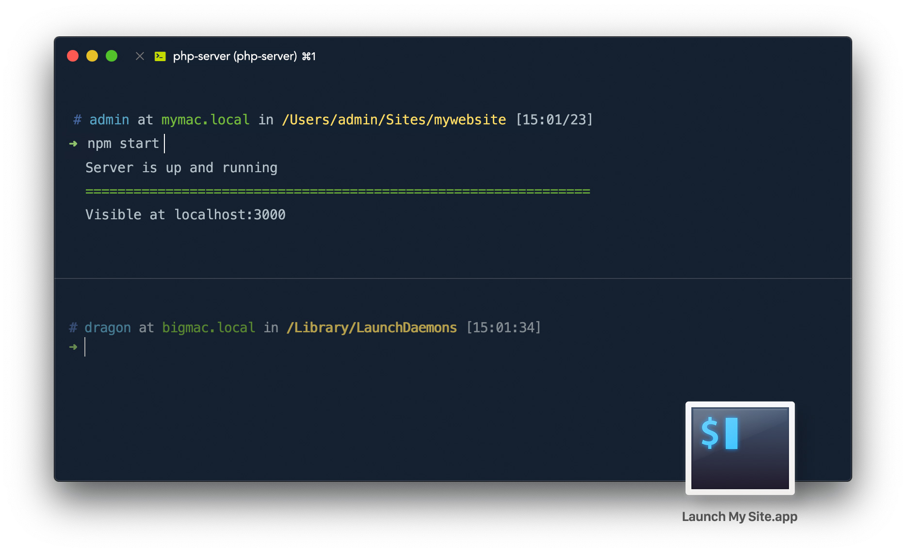

__Generate macOS apps which prepares and launch a developer workspace in [iTerm2](https://www.iterm2.com).__

How many times you have to open a new iTerm window, cd to your project directory, and write the command who starts a server or an app?



Create a __new__ specific __profile__ in iTerm2 (ex: `Developer Console`), create a new __property list__ for the __configuration__ (ex: `start_my_server.plist`), and __generate the app__ (ex: `Start My Server.app`).

__Launching__ this generated app will open iTerm, __create a new session__ with the desired profile, __cd__ to your __project directory__ and __execute the command__.

As it searches for existing iTerm windows with the same profile, you can launch two apps for two workspaces, and it split the window horizontally or vertically.

## Install & Configuration

### Generator script
Copy elements of __Resources folder__ in a directory of your choice. 
Edit the shell script `generate-iterm-developer-workspace.sh` and update the paths. 


| name | description  |
| ---- | ------------ |
| __elementsRoot__ | Folder containing the resources (icon, applescript, etc) |
| __appsDestination__ | Where the apps bundles are created. The script __DELETE__ the bundles inside when updating. |
| __signIdentifier__ | Developer ID certificate to sign the bundle. |
| __bundleCopyright__ | Copyright for the apps. |
| __bundleBaseIdentifier__ | Prefix of the bundle identifier |

#### Install `titleize` ruby gem
```
gem install titleize
```

### Configurations files (.plist)

Create or duplicate a configuration file (plist):

Rename the plist config like this `my_workspace_launcher.plist` to get an app name like that `My Workspace Launcher.app`.

| name | description  |
| ---- | ------------ |
| __profile_name__ | iTerm2 Profile to use (ex: `Developer Console`) |
| __project_cmd__ | The command to execute inside the project folder. |
| __project_path__ | The path to the project. |
| __vertically__ | Split existing session vertically if `true`. Default horizontally. |
| __assistant__ | Does not create a second session in the project folder if `false`. Default to `true` |


## Generate the apps

```
generate-iterm-developer-workspace
```

1. Compile the applescript to an app bundle.
2. Copy the configuration (plist) used by the script.
3. Copy the icon for the app.
4. Update Info.plist.
5. Sign the bundle if developer cert name is defined.

